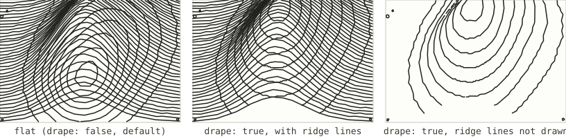
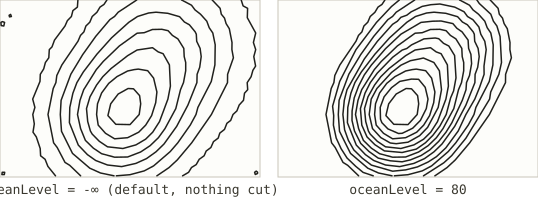

# Algorithm reference

Every algorithm here is the same shape: it takes a `HeightField` — elevation
sampled on a grid — and returns one or more groups of polylines, each meant
for a single pen. This page is a parameter-by-parameter reference for all
eight, with every parameter swept across its range so you can see what it
does before you spend a plot on it.

The illustrations were generated straight from the production code
(`renderTerrain` in [`src/core/algorithms/index.js`](../../src/core/algorithms/index.js)),
run against a synthetic two-peak test field rather than real elevation data —
see [how these were made](#how-these-were-made) — so what you see here is the
same code path the app runs, not a mockup of it.

| Algorithm | What it draws |
|---|---|
| [Ridge lines](ridgeline.md) | Horizontal scanlines lifted by elevation, with hidden-line removal. The Joy Division look. |
| [Contour lines](contours.md) | Isolines at fixed elevation intervals by marching squares. |
| [Contours, one pen per level](contours-by-level.md) | The same isolines, split by elevation so index contours take a heavier pen. |
| [Illuminated contours (Tanaka)](tanaka.md) | Contours weighted by the light, so flat isolines read as relief. |
| [Streamlines](streamlines.md) | Evenly spaced strokes running downhill. Reads as drainage and spurs. |
| [Streamlines along the hillside](streamlines-contour.md) | The same even spacing, following the contour direction instead. |
| [Hachures](hachures.md) | Short downslope strokes, longer and denser where steeper, blank where level. |
| [Hillshade hatching](hillshade-hatching.md) | Parallel rules whose density follows a computed hillshade. Renders tone. |

## Shared concepts

**Units.** Every parameter below is in *field samples* — the algorithms
never see millimetres. The settings panel exposes several of them in
millimetres instead (line spacing, stroke length, relief height) and converts
using the current page scale before calling in: at higher **Detail**, one
millimetre covers more samples, so the same millimetre value produces a finer
result. If a number you type doesn't look like what a parameter's default
below suggests, that conversion is usually why. The exact multiplier lives in
`sizeToSamples` in [`src/core/composite.js`](../../src/core/composite.js).

**Weight.** An algorithm that varies line weight to convey relief — Tanaka,
contours-by-level — cannot make one pen change width mid-stroke, so it splits
its output into several groups, each carrying a `weight` in `0..1`. The app
turns that into either extra plotting passes or a wider pen per layer; see
"Heavier lines" in the [main README](../../README.md#heavier-lines). In the
illustrations on this page, weight is simply drawn as stroke thickness.

**`planar`.** Contours, streamlines and hatching are drawn top-down and
nothing in them is behind anything else, so they carry no occlusion of their
own. Hidden-line removal belongs to ridge lines alone — see
[occlude](ridgeline.md#occlude) — though any of the planar algorithms can
still be *draped* onto the relief and cut by it; see Drape, below.

**Drape.** By default, every selected algorithm draws independently and flat
— see the first panel below, where a set of contours simply overlaps the
ridge lines as ink on paper overlaps, with no relationship between the two.
Turning drape on (`buildTerrainLayers({ drape: true, ... })` in
[`src/core/composite.js`](../../src/core/composite.js)) changes that: a
planar algorithm's output is lifted onto the exact displaced surface the
ridge lines are drawn on (`projectFieldPolyline` in
[`src/core/scene.js`](../../src/core/scene.js)) and hidden-line removed
against it, using a horizon built from *every* field row rather than only
the drawn ones — a contour lies on the ground between two ridge-line rows,
so testing it only against the rows that were actually drawn clipped it
into dashes that tracked the line count instead of the terrain. Draping
works even with the relief itself not drawn (`emitTerrain: false`): the
surface is still built and still hides what is behind it, it is just not
emitted, which is what gives contours alone with true hidden-line removal.



Like ocean level, this is not a per-algorithm parameter — it is a
composition-level option that applies to whichever planar algorithms are
selected — so it has no page of its own either; see "Combining algorithms"
in the [main README](../../README.md#combining-algorithms) for the
user-facing description.

**Ocean level.** One setting, shared by every algorithm: ground at or below
it is cut from the field before anything runs, via `cutBelow` in
[`src/core/heightField.js`](../../src/core/heightField.js). It is not a
per-algorithm parameter and so has no page of its own, but it changes every
algorithm's output the same way — the low ground is simply gone, and does
not count towards the elevation range the others normalise against:



**Sun azimuth and `zFactor`.** Tanaka and hillshade hatching are both lit by
the same synthetic sun (`computeHillshade` in
[`src/core/derived.js`](../../src/core/derived.js)), sharing one vertical
exaggeration constant (`HILLSHADE_Z_FACTOR = 3` in the algorithm registry) so
that combining both on one sheet gives one consistent relief rather than two
disagreeing ones. `zFactor` is not exposed in the UI; changing it means
editing that constant.

## How these were made

The synthetic field behind every illustration on this page is two Gaussian
peaks plus a small ripple, built by
[`scripts/generateAlgorithmDocs.test.js`](../../scripts/generateAlgorithmDocs.test.js).
It is a probe in the shape of `scripts/emitWeight.test.js` and
`scripts/probeHatchDrape.test.js` — a vitest file gated behind an environment
variable rather than a real test, so it shares the project's module
resolution instead of needing its own loader, and `npm test` never runs it.
Regenerate all twenty-three illustrations with:

```bash
GENERATE=1 npx vitest run scripts/generateAlgorithmDocs.test.js
```

Each sweep isolates one parameter at a time, holding the algorithm's other
options at their registry defaults (the value labelled `(default)` in each
strip). A couple of illustrations — `ridgeline-occlude`, and the
`count`/`separation` used for the Tanaka and streamlines sweeps — use a
value tuned for legibility at this size rather than the literal registry
default; each page says so where it applies.
