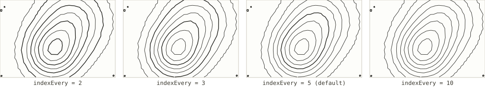

# Contours, one pen per level

*Registry id: `contours-by-level` · source: [`src/core/algorithms/index.js`](../../src/core/algorithms/index.js)*

The same marching-squares contours as [Contour lines](contours.md), but
returned as one group per elevation level instead of a single flat list.
Every `indexEvery`-th level is marked with `weight: 1`, the rest with
`weight: 0.5` — the same convention a paper map uses when it draws every
fifth contour heavier as an index line, so a reader can count elevation
without tracing every ring back to the coastline.

Because each level comes back as its own group, this is also what makes a
per-level pen colour or width possible: the app can hand a heavier pen to
the index contours and a lighter one to the rest, the same trade the
[main README](../../README.md#heavier-lines) describes for Tanaka.

## Parameters

This shares `count` and `interval` with [Contour lines](contours.md) — see
that page for how the actual elevation levels are chosen. The parameter
specific to this algorithm is `indexEvery`.

| Parameter | Default | Exposed in the UI as |
|---|---|---|
| `count` | `20` | "Contours, if auto" (see [Contour lines](contours.md#count)) |
| `interval` | `null` (auto) | Interval (m) (see [Contour lines](contours.md#interval)) |
| [`indexEvery`](#indexevery) | `5` | *not exposed — see below* |

### `indexEvery`

Every `indexEvery`-th contour, counting from the lowest level upward, is
drawn at `weight: 1`; the rest at `weight: 0.5`. A lower value gives more
frequent, closer-together heavy lines; a higher value gives fewer, and a
flatter-looking map in between them.

`indexEvery` is not reachable from the settings panel — the registry default
of `5` is what every sheet gets. To change it, pass `indexEvery` through
`renderTerrain('contours-by-level', { indexEvery })` directly, or edit the
default in `ALGORITHMS['contours-by-level'].defaults` in
[`src/core/algorithms/index.js`](../../src/core/algorithms/index.js).

*(Illustrated at `count: 12` rather than the registry default of 20 — at the
default density the individual index and normal contours sit close enough
together that the weight difference reads as noise rather than a heavier
line, at this illustration's size.)*

## See also

- [Contour lines](contours.md) for `count` and `interval`, which this
  algorithm shares unchanged.
- [Illuminated contours (Tanaka)](tanaka.md), the other algorithm that
  varies contour weight — there the weight follows the light rather than a
  fixed counting pattern.
- "Heavier lines" in the [main README](../../README.md#heavier-lines) for
  how a `weight` of `0.5`/`1` here becomes either extra plotting passes or a
  physically wider pen.
