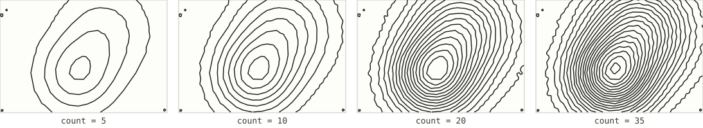
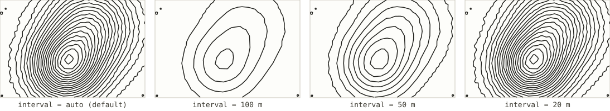

# Contour lines

*Registry id: `contours` · source: [`src/core/algorithms/contours.js`](../../src/core/algorithms/contours.js)*

Isolines at fixed elevation intervals, found by marching squares over the
height field. This is the most plotter-native of the eight algorithms:
closed loops, no overdraw, and every line means exactly one thing — an
elevation. It is also the only family here where "how many lines" and "how
far apart in elevation" are two ends of the same knob, since the app picks
one from the other whenever you leave the interval on auto.

Segments come out of the marching-squares pass unordered and have to be
chained into long strokes; that chaining reuses the plot optimizer's own
merge pass (`mergePolylines`) rather than a second implementation of it.

## Parameters

| Parameter | Default | Exposed in the UI as |
|---|---|---|
| [`count`](#count) | `25` | "Contours, if auto" |
| [`interval`](#interval) | `null` (auto) | Interval (m) |

### `count`

The number of contours to aim for when no fixed interval is given. The
actual interval is chosen from a list of round numbers real paper maps use —
1, 2, 5, 10, 20, 25, 50, 100 m, and on up — picking the smallest one that
gets at or under the requested count (`NICE_INTERVALS` in the source). So
`count` is a target, not an exact result: raising it by one rarely changes
anything, until it crosses a threshold where the whole map jumps to the next
finer interval.

### `interval`

A fixed elevation interval in metres, overriding `count` entirely. This is
what "Interval (m)" in the settings panel writes to; leaving it blank (`null`)
is what puts the panel in auto mode and hands control back to `count`.

A contour is nudged a fraction of a metre off any level that lands exactly on
a sample value before marching squares runs (`nudge` in the source) — without
it, a level sitting precisely on the data produces degenerate zero-length
crossings at cell corners. A cone-shaped hill is the textbook case, since its
elevation hits round numbers exactly; this synthetic field is a smoother
Gaussian and would rarely trigger it on its own; the fix is there because
real terrain can.

## See also

- [Contours, one pen per level](contours-by-level.md) — the same geometry,
  split by elevation so alternating contours can be plotted heavier, the way
  index contours are on a paper map.
- [Illuminated contours (Tanaka)](tanaka.md) — the same geometry again, this
  time weighted by which way each segment faces the light rather than by
  elevation.
- [`chooseLevels`](../../src/core/algorithms/contours.js) is the function
  both `count` and `interval` ultimately go through, and is exported
  separately for anything that needs to know which levels a field will
  produce without actually marching the grid.
