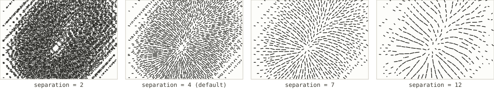
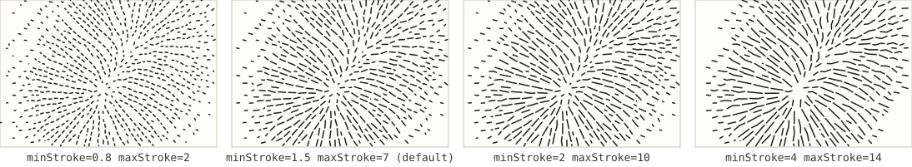
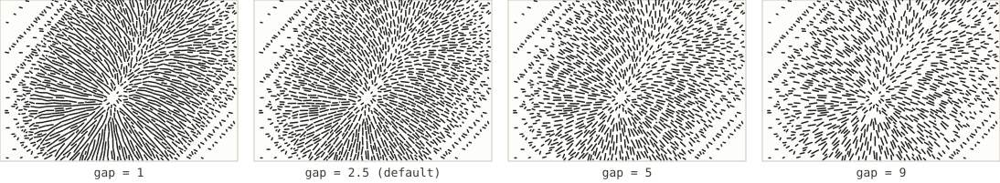

# Hachures

*Registry id: `hachures` · source: [`src/core/algorithms/hachures.js`](../../src/core/algorithms/hachures.js)*

Short strokes running straight down the slope, drawn longer and closer
together where the ground is steeper and left blank where it is level — the
nineteenth-century way of drawing relief, standardised by Lehmann in 1799.
On complex terrain, a field of hachures behaves like a dithering filter,
which is exactly what a single-colour pen needs to render tone rather than
just structure. This implementation follows the same idea behind Samsonov's
modern automated flowline hachures: it starts from the same evenly-spaced
downhill flowlines [Streamlines](streamlines.md) produces, then cuts each one
into dashes whose length and spacing report the local steepness.

## Parameters

| Parameter | Default | Exposed in the UI as |
|---|---|---|
| [`separation`](#separation) | `4` | Line spacing (mm) |
| [`minStroke` / `maxStroke`](#minstroke--maxstroke) | `1.5` / `7` | Stroke length (mm) |
| [`gap`](#gap) | `2.5` | Stroke gap (mm) |

Two more inputs shape the result but are not settings: `minSlope` / `maxSlope`
default to the terrain's own 20th and 95th steepness percentiles
(`slopePercentiles` in the source) rather than a fixed angle range. Real
terrain at typical resolution occupies a narrow band of possible slope
angles, so normalising against a fixed span leaves almost every stroke at
the minimum length; taking the range from the data itself is what spends the
available contrast where the terrain actually varies.

### `separation`

The spacing between the underlying flowline columns, in field samples —
mechanically identical to [Streamlines' `separation`](streamlines.md#separation),
since that is the function generating them. This sets how many hachure
"columns" cross the sheet; the length and gap of the dashes within each
column are governed separately, below.

### `minStroke` / `maxStroke`

The dash length, in samples, on the gentlest ground this algorithm still
draws (`minStroke`) and on the steepest (`maxStroke`). Every flowline is cut
into runs whose target length is interpolated between the two by the local
steepness — so widening the gap between them widens the contrast the
drawing can express between gentle and steep terrain.

### `gap`

The base spacing left blank between one dash and the next along a flowline.
The actual gap used is `gap × (1.6 - steepness)`, so steeper ground — which
is already drawn with longer strokes — also gets a shorter gap and reads
darker, while gentler ground gets both a shorter dash and a longer pause,
compounding to read lighter still.

## See also

- [Streamlines](streamlines.md) — the flowlines this algorithm cuts into
  dashes are produced by exactly that function, in `'slope'` mode.
- [Hillshade hatching](hillshade-hatching.md), the other algorithm that
  renders tone rather than structure, using straight rules and a computed
  hillshade instead of strokes that follow the terrain's own direction.
