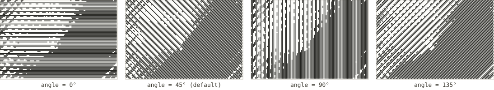
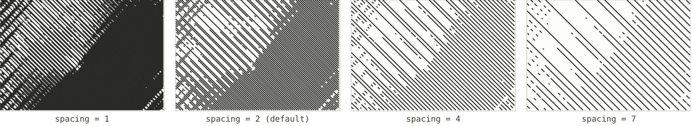
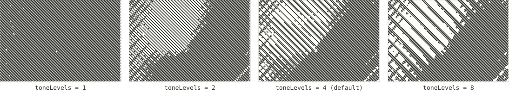
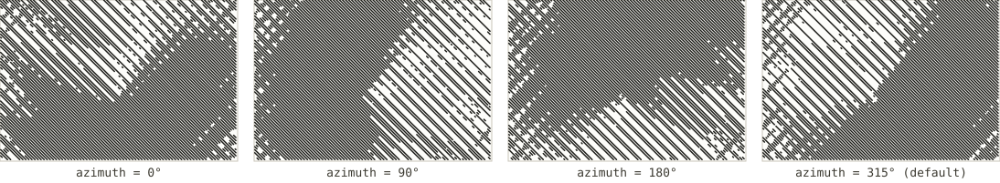

# Hillshade hatching

*Registry id: `hillshade-hatching` · source: [`src/core/algorithms/hachures.js`](../../src/core/algorithms/hachures.js)*

Straight, parallel rules at a fixed angle and base spacing, whose local
density follows a computed hillshade rather than the terrain's own
direction — the other tonal technique this app offers, alongside
[hachures](hachures.md). Because the rules have no relation to ridges or
slope direction, the result reads as shading rather than structure, closer
to the cross-hatching in an engraving than to a relief map.

The trick that keeps it plotter-clean is in how density varies: rules are
never moved or spaced differently to represent tone, since shifting fixed
positions around produces moiré. Instead, each rule belongs to one of
`toneLevels` interleaved passes, and a pass is only drawn where the ground is
dark enough to warrant it. So the lightest areas keep only every *n*th rule,
the darkest keep all of them, and every rule that does get drawn is always at
its one fixed position.

## Parameters

| Parameter | Default | Exposed in the UI as |
|---|---|---|
| [`angle`](#angle) | `45` | Hatch angle |
| [`spacing`](#spacing) | `2` | Hatch spacing (mm) |
| [`toneLevels`](#tonelevels) | `4` | Tonal levels |
| [`azimuth`](#azimuth) | `315` | Sun azimuth |
| `zFactor` | `3` | *shared constant — see [Shared concepts](README.md#shared-concepts)* |

One further input, `minTone`, is not a setting either: ground at or above 92%
brightness (`minTone: 0.92` in the source) is left blank regardless of which
pass is due, so the very lightest slopes stay paper-white instead of
carrying a faint texture no plotter could usefully render.

### `angle`

The rule direction, in degrees — `0` is horizontal. This has nothing to do
with the sun; it is a pure drawing choice, the same way a cross-hatch
illustrator picks a stroke direction independent of where the light in the
scene is meant to come from.

### `spacing`

The distance between adjacent rules, in field samples — the base grid every
rule sits on before any are dropped by tone. This is the single biggest
lever on how dark the sheet reads overall, since it sets how much ink is
available at every tone level at once.

### `toneLevels`

How many interleaved passes the rules are split into, and so how many
distinguishable tonal steps the drawing can show between "every rule drawn"
and "none." More levels give smoother gradation; fewer give a starker,
more graphic split between light and dark.

At `toneLevels: 1` every rule belongs to the same single pass and is drawn
wherever the ground is dark enough at all — there is no gradation left, only
on or off.

### `azimuth`

The light's direction, in degrees clockwise from north — identical in
meaning to [Tanaka's `azimuth`](tanaka.md#azimuth), and drawn from the same
sun: both algorithms call `computeHillshade` with the same `zFactor`, so
combining them on one sheet gives one consistent relief instead of two
disagreeing ones (see [Shared concepts](README.md#shared-concepts)).

## See also

- [Hachures](hachures.md) — the other tonal algorithm, using strokes that
  follow the terrain's own downhill direction instead of a fixed rule angle.
- [Illuminated contours (Tanaka)](tanaka.md), which shares this algorithm's
  sun and `zFactor` exactly.
