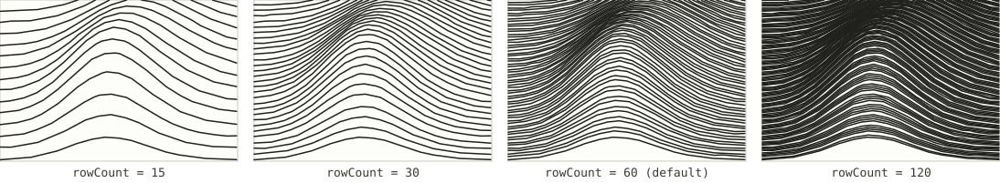
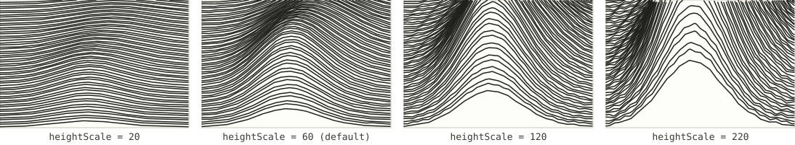
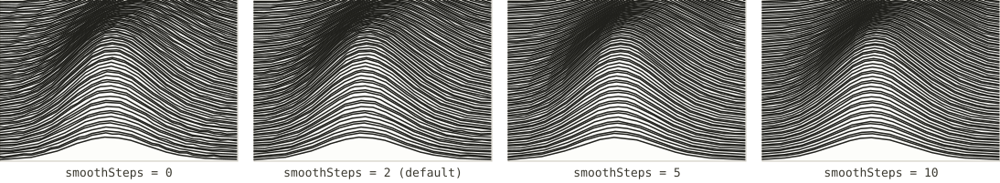
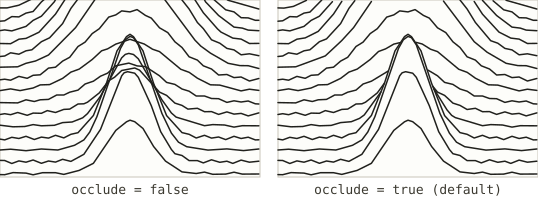

# Ridge lines

*Registry id: `ridgeline` · source: [`src/core/algorithms/ridgeline.js`](../../src/core/algorithms/ridgeline.js)*

Horizontal scanlines, one per row of the field, each displaced upward in
proportion to the elevation it crosses. Rows are walked from the bottom of
the field to the top — nearest first — so a nearer ridge can hide the parts
of a farther one that fall behind it. This is the algorithm the upstream
project ([anvaka/peak-map](https://github.com/anvaka/peak-map)) was built
around, and it is still the one this fork calls the Joy Division look, after
the *Unknown Pleasures* cover it resembles.

It is the only algorithm in this app that produces a true 3D relief rather
than a flat, top-down drawing — see [`planar`](README.md#shared-concepts) —
which is why occlusion and relief height live here and nowhere else.

## Parameters

| Parameter | Default | Exposed in the UI as |
|---|---|---|
| [`rowCount`](#rowcount) | `60` | Line count |
| [`heightScale`](#heightscale) | `60` | Relief height (mm) |
| [`smoothSteps`](#smoothsteps) | `2` | Smoothing (mm) |
| [`occlude`](#occlude) | `true` | Hide what is behind |

### `rowCount`

How many scanlines cover the field, evenly spaced from the top edge to the
bottom. More rows resolve finer ridges but cost more ink and more plotting
time; fewer rows read as a bolder, more graphic silhouette.

Rows are placed to span the whole field edge-to-edge rather than centred on
the highest point, which is what the upstream renderer did. That means a
summit can fall up to half a row's spacing from the nearest drawn line — a
smaller error than the blank margin the old approach left at the bottom edge
of a sheet with no margins. See `createRowIterator` in the source.

### `heightScale`

Vertical displacement, applied to the full elevation range and expressed in
field samples (the UI's "Relief height" slider works in millimetres and
converts before calling in — see [Units](README.md#shared-concepts)). This is
literally how tall the relief stands on the page: it is also what the
over-plotted rows below the sheet's bottom edge are sized against, since a
peak sitting on the near edge needs to be lifted clear of it. There is
nothing to tune there independently — see "Paper" in the
[main README](../../README.md#paper).

Pushed far enough, a tall foreground peak's lifted silhouette can rise clear
past the top of the sheet, or past shorter terrain behind it — which is
exactly the case [`occlude`](#occlude) exists to resolve cleanly rather than
leave as a tangle.

### `smoothSteps`

The half-window of a moving average applied to each row's *y* values after
displacement — `0` disables it. Real elevation data carries per-sample noise
that a scanline renders as visible jitter; smoothing trades that jitter for
softer, calmer curves. Too much washes out real ridges along with the noise.

This runs on the already-displaced row, so it costs `O(windowSize)` per point
and is applied independently of every other parameter — it never changes
*which* geometry is visible, only how each visible run is shaped.

### `occlude`

Whether a row's geometry is clipped where it falls behind terrain nearer rows
already drew. The mechanism is a per-column horizon
(`src/core/occlusion.js`): each column of the field remembers the highest
point drawn in it so far, and anything a farther row draws at or below that
horizon is simply not emitted.

*(Illustrated on a field built specifically for this: a narrow, prominent
foothill directly in front of a taller, broader peak on the same column,
drawn with fewer, bolder rows than the sweeps above. A single smooth hill
barely triggers occlusion, and with dozens of closely-spaced rows the clipped
gap is usually filled in by the very next row over — so the effect is real
but easy to miss at realistic settings. This field and row count make it
unambiguous: without occlusion, the strokes behind the foothill cross and
tangle near the summit; with it on, they are cleanly cut.)*

Occlusion belongs to ridge lines alone: contours, streamlines and hatching
are drawn top-down, and nothing in them is behind anything — see
[`planar`](README.md#shared-concepts). It also decides whether GPX tracks
riding the relief get occlusion modes (hidden / dotted / always visible) or a
flat knockout corridor instead.

## See also

- [Contour lines](contours.md) and the rest of the planar algorithms, which
  can be draped onto this same relief and cut by it without drawing the ridge
  lines themselves — see "Combining algorithms" in the
  [main README](../../README.md#combining-algorithms).
- [Ocean level](README.md#shared-concepts), which trims the field these rows
  are drawn from.
