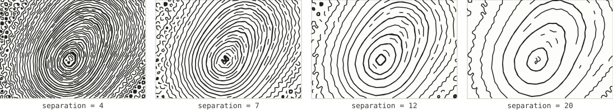

# Streamlines along the hillside

*Registry id: `streamlines-contour` · source: [`src/core/algorithms/index.js`](../../src/core/algorithms/index.js), built on [`src/core/algorithms/streamlines.js`](../../src/core/algorithms/streamlines.js)*

Exactly the [Streamlines](streamlines.md) engine, with `mode` fixed to
`'contour'`: every stroke follows the direction perpendicular to the
gradient — along the hillside — rather than downhill. The result looks like
a hand-drawn contour map, but the strokes are placed by even spacing rather
than at fixed elevations, so they do not carry the "this line means one
specific height" meaning real contours do. Where a slope is uniform this
reads almost identically to true contours; where it is not, the spacing
stays even while true contours would bunch up or spread apart with the
terrain.

This page exists separately from [Streamlines](streamlines.md) because it is
its own entry in the algorithm list — its own checkbox, its own pen — even
though the code underneath is shared. For the full account of how the
integration and spacing actually work, see that page; this one covers only
what is specific to running it in `'contour'` mode.

## Parameters

Every parameter here is exactly [Streamlines](streamlines.md)'s, with `mode`
pinned. See that page for `minLength`, `stepSize`, and the internal safety
limits (`maxSteps`, `maxLines`, `recordSpacing`).

| Parameter | Default | Exposed in the UI as |
|---|---|---|
| [`separation`](#separation) | `5` | Line spacing (mm) |
| `mode` | `'contour'` *(fixed)* | *fixed by algorithm choice* |

### `separation`

Identical in mechanism to [Streamlines' `separation`](streamlines.md#separation)
— the target spacing between strokes, in field samples, enforced by the same
grow-and-reject seeding rather than a naive grid.

Because strokes here run along the hillside instead of downhill, a tighter
separation reads less like "more drainage detail" and more like "more
contour-like bands" — at wide spacing the terrain's overall shape still
comes through as a few sweeping curves; at tight spacing it starts to
resemble true contour lines, minus their fixed elevation meaning.

## See also

- [Streamlines](streamlines.md) for the full mechanism — seeding, the
  Jobard–Lefer integration, and every other parameter.
- [Contour lines](contours.md), for when the lines need to mean a specific
  elevation rather than just an even, hillside-following spacing.
