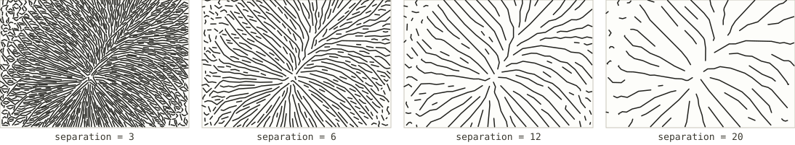
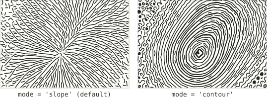
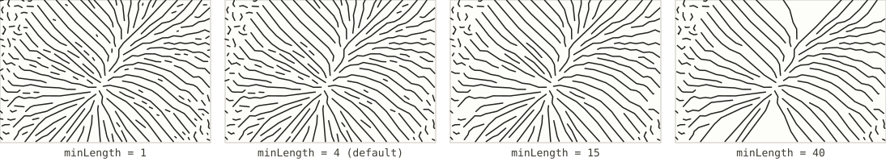

# Streamlines

*Registry id: `streamlines` · source: [`src/core/algorithms/streamlines.js`](../../src/core/algorithms/streamlines.js)*

Evenly spaced strokes traced through the terrain's gradient field, after
Jobard and Lefer's 1997 algorithm for creating evenly-spaced streamlines of
arbitrary density. Rather than seeding strokes on a grid and accepting
whatever spacing falls out — which clumps in steep terrain and leaves bald
patches on flat ground — every new streamline is grown from a seed placed
exactly one `separation` away from an existing one, and stopped the moment it
comes too close to anything already drawn. The result is a plot with even
coverage everywhere: no clumping, no gaps, which is what a pen needs.

In this algorithm the strokes follow the slope downhill, so the drawing
reads as drainage and spurs — the way water would actually run off the
terrain. [Streamlines along the hillside](streamlines-contour.md) is the same
engine with [`mode`](#mode) fixed to the other setting.

## Parameters

| Parameter | Default | Exposed in the UI as |
|---|---|---|
| [`separation`](#separation) | `5` | Line spacing (mm) |
| [`mode`](#mode) | `'slope'` | *fixed by algorithm choice — see below* |
| [`minLength`](#minlength) | `4` | *not exposed — see below* |
| `stepSize` | `0.5` | *not exposed; derived from separation in the app — see below* |

### `separation`

The target spacing between strokes, in field samples. This is the one number
that drives the whole algorithm: candidate seed points are placed
`separation / 2` apart, a new stroke is grown from whichever unclaimed seed
sits on the steepest ground, and integration stops the instant a stroke
comes within `separation × testFactor` (half the separation, by default) of
anything already accepted.

A smaller separation packs in more strokes and more plotting time; because
the algorithm actively prevents crowding rather than just seeding densely,
turning it down does not produce clumps the way a naive grid of seeds would
— it produces a genuinely finer, still-even texture.

### `mode`

Which direction each stroke follows through the gradient field:

- **`'slope'`** (default) — downhill, the negative gradient. Strokes read as
  drainage: they fan out from ridges and converge into valleys.
- **`'contour'`** — perpendicular to the gradient, along the hillside.
  Strokes read like isolines, but evenly spaced by geometry rather than
  seeded at fixed elevations. This is exactly what
  [Streamlines along the hillside](streamlines-contour.md) is: the same
  function, called with `mode: 'contour'` fixed in the registry rather than
  left for the caller to choose.

`mode` is not a setting you pick independently in the UI — choosing between
the "Streamlines" and "Streamlines along the hillside" algorithms *is* how
`mode` gets set. It is documented as a parameter here because both
algorithms share this one implementation.

### `minLength`

The shortest stroke, by total path length in samples, worth keeping. Every
integration produces some very short strokes — a seed placed near a saddle
or a ridge crest, where the gradient nearly vanishes and the stroke has
almost nowhere to go before it is stopped. `minLength` discards those.

*(Illustrated at `separation: 9` rather than the default `5` — at the default
spacing nearly every stroke already clears even the largest value in this
sweep, so raising `minLength` has almost nothing to discard. A wider
separation leaves more short stubs near the ridge and saddle for it to
actually filter.)*

### `stepSize` and other internal parameters

`stepSize` is the Runge–Kutta integration step, in samples; the app does not
expose it directly, but derives it from `separation` before calling in
(`options.stepSize = Math.max(0.25, separation / 8)` in
[`src/core/composite.js`](../../src/core/composite.js)), so a coarser stroke
spacing also integrates more coarsely. A handful of other options exist
purely as safety limits and are not meant to be tuned per-sheet: `maxSteps`
(cap on one stroke's length), `maxLines` (hard cap on total strokes, so an
aggressive separation cannot hang the browser), and `recordSpacing` (how
often a vertex is actually recorded along an integrated path, independent of
the integration step itself — see the source for why the two are kept
separate).

## See also

- [Streamlines along the hillside](streamlines-contour.md) — this same
  algorithm with `mode` fixed to `'contour'`.
- [Hachures](hachures.md), which is built on this same evenly-spaced
  integration and then cuts the result into short dashes.
