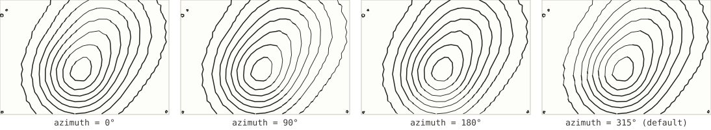
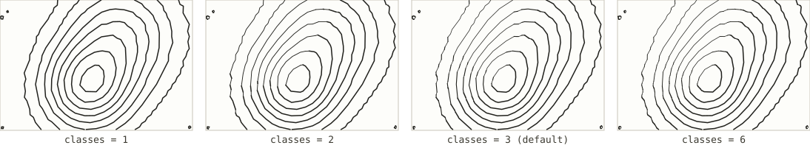
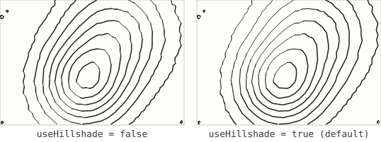

# Illuminated contours (Tanaka)

*Registry id: `tanaka` · source: [`src/core/algorithms/contours.js`](../../src/core/algorithms/contours.js)*

Contours whose weight follows a simulated light, so that a set of flat
isolines reads as relief without ever drawing a hillshade fill. Named for
Kitiro Tanaka, who described the technique in 1950: a contour is drawn heavy
where it faces the light and light where it faces away, the same logic that
makes a lit sphere read as round from its shading alone. A pen cannot vary
its width mid-stroke, so segments are sorted into a handful of weight classes
and each class becomes its own group — the same one-group-per-weight
mechanism [contours-by-level](contours-by-level.md) uses.

There are two ways to decide how lit a segment is, switched by
[`useHillshade`](#usehillshade): the original method looks only at which way
the contour itself faces, and a slower, truer method (the default here)
looks at a fully computed hillshade instead.

## Parameters

This shares `count` and `interval` with [Contour lines](contours.md) for
which elevations get contoured; see that page for those two.

| Parameter | Default | Exposed in the UI as |
|---|---|---|
| `count` | `25` | "Contours, if auto" (see [Contour lines](contours.md#count)) |
| [`azimuth`](#azimuth) | `315` | Sun azimuth |
| [`classes`](#classes) | `3` | Weight classes |
| [`useHillshade`](#usehillshade) | `true` | *not exposed — see below* |
| `zFactor` | `3` | *shared constant — see [Shared concepts](README.md#shared-concepts)* |

### `azimuth`

The light's direction, in degrees clockwise from north — the same convention
a compass rose uses, and the same azimuth [hillshade hatching](hillshade-hatching.md)
takes, since the two share one sun. Rotating it rotates which side of every
contour reads as lit and which reads as shaded.

*(Illustrated at `classes: 2` rather than the default 3 — a stark two-way
split between light and heavy makes the lit side rotating with azimuth
obvious; at three or more classes the middle bucket blurs the two extremes
together at this size.)*

### `classes`

How many weight buckets segments are sorted into. More classes give finer
gradation between fully lit and fully shaded, at the cost of a pen that has
to make more distinct passes (or a plot with more distinct pen widths, if
[weighted by a wider pen](../../README.md#heavier-lines) instead).

At `classes: 1` every segment lands in the same bucket and the illumination
has no visible effect — the contours are lit, but every pixel gets the same
one weight, so the shading disappears. `classes` has to be at least `1`;
the function throws otherwise.

### `useHillshade`

Which of the two lighting methods weights each segment.

- **`false`** — `tanakaClasses`, the original Tanaka method: illumination is
  computed straight from the contour segment's own direction relative to the
  light, ignoring how steep the ground actually is at that point.
- **`true`** (default) — `shadeWeightedClasses`: illumination is sampled
  from a fully computed hillshade grid (the same one
  [hillshade hatching](hillshade-hatching.md) draws from), which accounts for
  the real local slope rather than just the contour's own bearing. Slower,
  and closer to how the ground actually looks lit.

## See also

- [Contour lines](contours.md) for `count` and `interval`.
- [Contours, one pen per level](contours-by-level.md), the other algorithm
  built on weighted groups, there driven by a fixed counting pattern instead
  of light.
- [Hillshade hatching](hillshade-hatching.md), which is lit by the exact same
  sun and shares `zFactor`, so that combining both on one sheet gives one
  consistent relief instead of two disagreeing ones.
